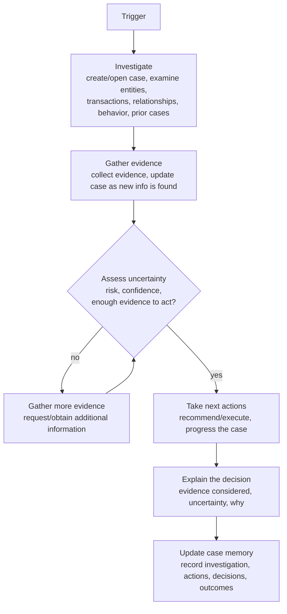
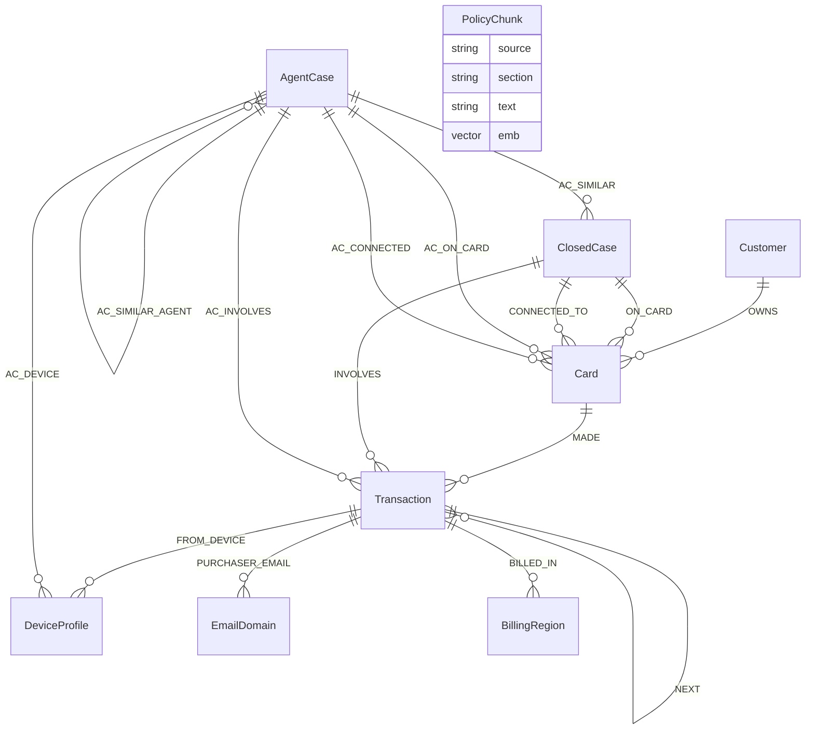

# FraudGraph Agent

An agentic fraud investigator for the TigerGraph x Hacker House Goa challenge. It takes an alert (risk score, customer report or analyst request), investigates it on a TigerGraph knowledge graph, decides what kind of fraud it is, recommends the next best action under the bank's fraud policy, asks for more evidence when the picture is uncertain, explains itself, and writes the case back into the graph as memory.

## Architecture

    alert -> Investigator (agent/investigator.py)
              1 investigate  GSQL queries: card_txns, device_txns, device_closed_cases, card_closed_cases, ring_expand
              2 gather       episode model + rule detectors (card testing, structuring, device ring)
              3 GraphRAG     TigerGraph vector search over 5,565 closed-case narratives + policy/typology chunks
              4 assess       calibrated fraud probability, pattern, independent-signal count
              5 recommend    deterministic policy engine (agent/policy.py, rules R1-R10, approval routes)
              6 evidence     simulated customer reply (assumption recorded), recommendation updated
              7 explain      LLM writes summary / SAR narrative from structured facts only (via OmniRoute)
              8 remember     AgentCase vertex + edges + embedding written to TigerGraph

- **Graph** (`gsql/`): Customer, Card, Transaction, DeviceProfile, EmailDomain, BillingRegion, ClosedCase, PolicyChunk, AgentCase; 590,742 transactions, 14,893 cards. TigerGraph 4.2.5 Community Edition in Docker. Vector attributes on ClosedCase, PolicyChunk, AgentCase.
- **TigerGraph MCP** (`agent/mcp_client.py`): the agent talks to the graph through a persistent `tigergraph-mcp` stdio session — every read goes through `tigergraph__run_installed_query` / `tigergraph__get_node` / `tigergraph__get_vertex_count`, every case-memory write through `tigergraph__add_node` / `tigergraph__add_edge`. `MCPGraphClient` implements the same interface as the direct `GraphClient` (`agent/data_access.py`), verified for identical results on `card_txns`, `device_txns`, `device_closed_cases`, `ring_expand`, and `similar_cases`. `make_graph_client()` selects it by default and falls back to the direct pyTigerGraph client if `tigergraph-mcp` isn't installed or running (`USE_TIGERGRAPH_MCP=false` forces the fallback).
- **LLM only reasons and writes.** Actions and approval routes come from the policy engine, so the LLM cannot breach policy.
- **Models** (`scripts/train_models.py`, `scripts/train_episode.py`): gradient boosting over graph-derived features, trained on the closed cases. The bank risk score is deliberately excluded from the fraud model. Grouped 5-fold CV: fraud AUC 0.987, pattern accuracy 0.83, episode F1 0.80. The same feature code runs against an in-memory client (training) and the TigerGraph client (production); outputs were checked identical.
- **UI** (`ui/index.html`, `api/app.py`): analyst dashboard with the alert queue, live streamed investigation timeline, uncertainty gauge, initial vs final actions, evidence with sources, SAR, graph view and case memory.

### Pipeline

```mermaid
flowchart LR
  A[Trigger\nrisk score / customer report / analyst] --> B[1. Investigate\nGSQL: card_txns, device_txns,\ndevice_closed_cases, card_closed_cases, ring_expand]
  B --> C[2. Gather\nepisode model + rule detectors]
  C --> D[3. GraphRAG\nsimilar_cases + similar_agent_cases + policy_search]
  D --> E[4. Assess\ncalibrated fraud probability, pattern, signal count]
  E --> F[5. Recommend\npolicy engine: rules R1-R10, approval routes]
  F --> G[6. Evidence\nsimulated reply, recommendation updated]
  G --> H[7. Explain\nLLM writes summary / SAR from structured facts]
  H --> I[8. Remember\nAgentCase vertex + edges + embedding written to graph]
  I -.feeds next case's step 3.-> D
```



### Core investigation flow



### Graph schema



`ClosedCase.emb`, `PolicyChunk.emb`, `AgentCase.emb` are 1024-d cosine vector attributes (`gsql/vectors.gsql`), searched by `similar_cases`, `policy_search`, and `similar_agent_cases` (`gsql/vector_queries.gsql`).

### UI wireframe (`ui/index.html`)

```
┌─────────────────────────────────────────────────────────────────────────┐
│ header: FraudGraph Agent                                                │
├───────────────┬─────────────────────────────────────────────────────────┤
│ aside          │ main                                                    │
│                │                                                         │
│ Alert Queue    │  (no case selected)                                    │
│  - filters:    │  "Select an Alert to Investigate"                      │
│    all/fraud/  │                                                         │
│    legit/      │  (case selected)                                       │
│    uncertain   │  ┌───────────────────────────────────────────────────┐ │
│  - alert rows  │  │ Investigation Timeline           [live: N steps]  │ │
│    (risk,      │  ├───────────────────────────────────────────────────┤ │
│    customer,   │  │ Uncertainty & Calibrated Verdict                  │ │
│    analyst)    │  │   stop rule: p >= 0.85 or <= 0.15   [gauge]       │ │
│                │  ├───────────────────────────────────────────────────┤ │
│                │  │ Next Best Action        [Policy Rules R1-R10]     │ │
│                │  │   initial actions  |  final actions  | changed   │ │
│                │  ├───────────────────────────────────────────────────┤ │
│                │  │ Agent Reasoning Trace                             │ │
│                │  ├───────────────────────────────────────────────────┤ │
│                │  │ Suspicious Activity Report (FinCEN SAR)           │ │
│                │  │   [FILE_REPORT · Requires L2 Approval] or [n/a]   │ │
│                │  ├───────────────────────────────────────────────────┤ │
│                │  │ Live Streamed Trace                [Streaming...] │ │
│                │  ├───────────────────────────────────────────────────┤ │
│                │  │ Subgraph Topology                  [graph_case_id]│ │
│                │  ├───────────────────────────────────────────────────┤ │
│                │  │ Grounding Evidence                  [N facts]     │ │
│                │  ├───────────────────────────────────────────────────┤ │
│                │  │ Case Memory (TigerGraph Vector Retrieval)         │ │
│                │  └───────────────────────────────────────────────────┘ │
└───────────────┴─────────────────────────────────────────────────────────┘
```

Backed by `api/app.py`: `GET /api/cases` (queue), `GET /api/cases/{id}` (detail), `GET /api/stats`, `POST /api/investigate/{id}` (re-run live).

## Run

    docker run -d --name tg -p 14240:14240 -p 9000:9000 --ulimit nofile=1000000:1000000 tigergraph/community:latest
    python scripts/prepare_data.py            # slim CSVs + card ids + device profiles
    # apply gsql/schema.gsql, gsql/vectors.gsql, gsql/load.gsql, gsql/queries.gsql, gsql/vector_queries.gsql
    python scripts/load_graph.py
    python scripts/embed_and_load.py          # embeddings via OmniRoute into TigerGraph vectors
    python scripts/build_training_set.py && python scripts/train_models.py && python scripts/train_episode.py
    pip install tigergraph-mcp                # TigerGraph MCP server the agent talks to (agent/mcp_client.py)
    python scripts/run_cases.py               # writes cases/HHG-001.json ... HHG-020.json
    uvicorn api.app:app --port 8088           # dashboard at http://127.0.0.1:8088

Secrets live in `.env` (git-ignored): `OMNIROUTE_BASE_URL`, `OMNIROUTE_API_KEY`, `OLLAMA_*`.

## Honest limitations

- Customer and analyst replies are simulated (allowed by the brief); every assumption is recorded in `evidence_requests`.
- No answer key is available, so benchmark accuracy is unmeasured. Cross-validated numbers above are on the closed cases only.
- The closed cases have a distribution quirk: cleared cases sit on light cards with widely shared devices. Models can pick that up, so probabilities are shrunk and the agent runs a verification loop when signals are few.
- Fraud episode reconstruction is weakest for account takeover on very heavy cards.
- Case memory retrieves the agent's own prior investigations (`similar_agent_cases`, `gsql/vector_queries.gsql`) alongside closed-case history, merged by vector distance in `Investigator._graphrag`. Re-run `gsql/schema.gsql` and `gsql/vector_queries.gsql` to pick up the `AC_SIMILAR_AGENT` edge and new query before the next `run_cases.py`.
- `tigergraph-mcp` logs a harmless `Deprecated parameter format` warning per scalar query parameter (it retries via GET and succeeds every time) — a JSON-RPC argument can't carry pyTigerGraph's Python-tuple VERTEX-typed-parameter convention, so the server falls back to its older plain-string path. Cosmetic only, verified against identical results from the direct client.

## Still to do for submission

3-5 minute demo video. Technical blog post and X/LinkedIn post are drafted, pending posting.
