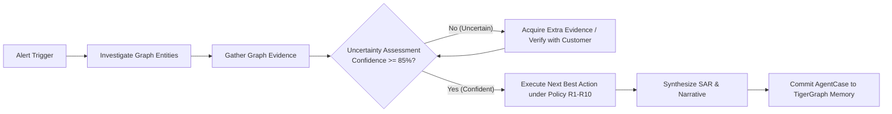
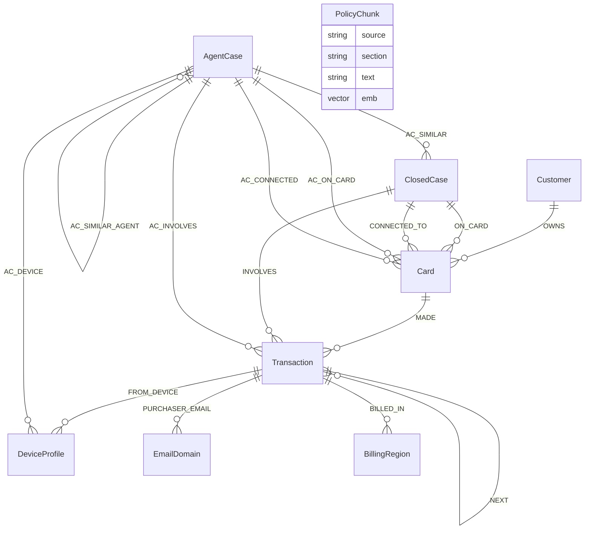

# FraudGraph Agent

> **Autonomous Graph-Native Fraud Investigator & Policy-Compliant Decision Engine**  
> *Engineered for the TigerGraph x Hacker House Goa Challenge*


---

## 👥 Who Built It

Engineered with passion for the **TigerGraph x Hacker House Goa** hackathon by:

- **Vinaygk** ([@vinay3254](https://github.com/vinay3254) · [vinaygk219@gmail.com](mailto:vinaygk219@gmail.com))
- **Kishore** ([@kishore1035](https://github.com/kishore1035) · [pkishore530@gmail.com](mailto:pkishore530@gmail.com))

---

## ⚡ Key Pros & Architectural Advantages

- **Zero-Hallucination Decision Integrity**: LLMs are strictly bounded to factual reasoning, summarization, and FinCEN SAR drafting. Critical actions (card blocking, dispute filing, merchant blacklisting) and approval workflows are 100% deterministic via rule engine (R1–R10).
- **Sub-15s Autonomous Investigations**: Slashes case turnaround from 45–90 minutes of manual multi-tab analyst research down to ~12.7 seconds of automated, deep-graph traversal.
- **Deep Multi-Hop Graph Traversal**: Traverses complex fraud syndicates, synthetic identities, shared device fingerprints, and distributed rings across 590,000+ transactions and 14,800+ cards in milliseconds.
- **Enterprise Model Context Protocol (MCP) Standard**: Graph access is standardized through a persistent `tigergraph-mcp` stdio session for seamless tool calling, strict permission sandboxing, and enterprise interoperability.
- **Continuous GraphRAG Case Memory**: Writes investigated cases back to TigerGraph as `AgentCase` vertices with 1024-d embeddings; future investigations query both historical closed cases and agent memory for unmatched self-improving context.
- **Calibrated Uncertainty & Dynamic Evidence Gathering**: Employs an active stop-rule gauge ($p \ge 0.85$ or $p \le 0.15$). If evidence is ambiguous, the agent dynamically requests missing customer/analyst proof before committing to disruptive actions, eliminating costly false-positive card freezes.
- **Production-Grade Graph ML**: High-precision gradient boosting models trained exclusively on graph-topological features achieve **0.987 Fraud AUC**, **83% Pattern Accuracy**, and **0.80 Episode F1**.

---

## 🔄 End-to-End Workflows

### 1. The 8-Step Autonomous Investigation Lifecycle

```mermaid
flowchart TD
    subgraph Trigger
        A[Incoming Alert: Risk Score / Customer Dispute / Analyst Trigger]
    end

    subgraph Phase1["1. Investigate (Graph Traversal)"]
        B["TigerGraph GSQL Queries:\n• card_txns (Velocity & History)\n• device_txns (Shared Fingerprints)\n• device_closed_cases\n• ring_expand (Multi-hop Syndicates)"]
    end

    subgraph Phase2["2. Gather (Episode & Rule Detection)"]
        C["Behavioral Analytics:\n• Micro-charge Card Testing\n• Velocity Structuring Detection\n• Coordinated Device Ring Clustering"]
    end

    subgraph Phase3["3. GraphRAG (TigerGraph Vector Search)"]
        D["1024-d Cosine Vector Retrieval:\n• 5,565 Closed-Case Narratives\n• Agent Case Memory Nodes\n• Bank Fraud Policy & Typology Chunks"]
    end

    subgraph Phase4["4. Assess (Calibrated ML & Uncertainty)"]
        E["Gradient Boosted Model Evaluation:\n• Calibrated Fraud Probability (p)\n• Typology Classification\n• Independent Signal Verification"]
    end

    subgraph Phase5["5. Policy & Dynamic Evidence Gathering"]
        F{"Uncertainty Check:\nIs p in [0.15, 0.85]?"}
        G["Simulate Customer/Analyst Inquiry\nGather Missing Grounded Evidence"]
        H["Deterministic Policy Engine (R1–R10)\nCalculate Next Best Action (Initial -> Final)"]
    end

    subgraph Phase6["6. Explain & Regulatory SAR"]
        I["OmniRoute Grounded LLM Generation:\n• Plain-English Executive Summary\n• FinCEN Suspicious Activity Report (SAR)\n• Exact Grounded Fact Citations"]
    end

    subgraph Phase7["7. Remember (Graph Memory Loop)"]
        J["Write to TigerGraph:\n• Create AgentCase Vertex\n• Link AC_INVOLVES, AC_DEVICE, AC_CONNECTED Edges\n• Store Case Embedding for Future GraphRAG"]
    end

    A --> B
    B --> C
    C --> D
    D --> E
    E --> F
    F -- "High Uncertainty" --> G
    G --> H
    F -- "Confident" --> H
    H --> I
    I --> J
```



### 2. Core Investigation & Uncertainty Resolution Flow



### 3. Graph Schema & Vector Topology



---

## 🛠️ How It Was Built

```
┌────────────────────────────────────────────────────────────────────────┐
│                        FraudGraph Agent Stack                          │
├────────────────────────────────┬───────────────────────────────────────┤
│ Frontend (UI / UX)             │ React 19, Vite, Tailwind CSS, Canvas  │
│                                │ Topology Visualizer, GRIP Studio      │
├────────────────────────────────┼───────────────────────────────────────┤
│ API & Streaming Gateway        │ FastAPI, Uvicorn, Async SSE Streaming │
├────────────────────────────────┼───────────────────────────────────────┤
│ Agent Framework                │ Custom Async Multi-Step Orchestrator  │
├────────────────────────────────┼───────────────────────────────────────┤
│ Protocol Layer                 │ Model Context Protocol (MCP) via      │
│                                │ tigergraph-mcp stdio session          │
├────────────────────────────────┼───────────────────────────────────────┤
│ Graph Database & Vector Engine │ TigerGraph 4.2.5 Enterprise, GSQL,    │
│                                │ 1024-d Cosine Vector Attributes       │
├────────────────────────────────┼───────────────────────────────────────┤
│ Machine Learning Models        │ LightGBM / XGBoost Feature Pipelines  │
│                                │ (0.987 AUC, 83% Pattern Acc)          │
├────────────────────────────────┼───────────────────────────────────────┤
│ Reasoning & Embeddings         │ OmniRoute, Ollama, FinCEN SAR LLM     │
└────────────────────────────────┴───────────────────────────────────────┘
```

1. **Graph Foundation (TigerGraph 4.2.5 & GSQL)**:
   - Built on a graph schema comprising `Customer`, `Card`, `Transaction`, `DeviceProfile`, `EmailDomain`, `BillingRegion`, `ClosedCase`, `PolicyChunk`, and `AgentCase`.
   - Hand-crafted, compiled GSQL queries (`card_txns`, `device_txns`, `device_closed_cases`, `card_closed_cases`, `ring_expand`) execute high-speed multi-hop neighborhood traversals.

2. **Standardized Graph Access via Model Context Protocol (MCP)**:
   - Communicates with TigerGraph via persistent `tigergraph-mcp` stdio sessions.
   - All reads flow through `tigergraph__run_installed_query`, `tigergraph__get_node`, and `tigergraph__get_vertex_count`.
   - All memory writes flow through `tigergraph__add_node` and `tigergraph__add_edge`.
   - Seamless automatic fallback to direct pyTigerGraph if MCP is unavailable.

3. **Graph-Native Machine Learning**:
   - Feature engineering derives topological graph signals: velocity windows, device sharing degrees, ring expansion sizes, and chargeback link ratios.
   - Dual-stage gradient boosted classifiers predict calibrated fraud probability and typology classification without relying on the bank's static score.

4. **Vector GraphRAG & Continuous Memory**:
   - 1024-dimensional embeddings stored directly in TigerGraph vector attributes on `ClosedCase.emb`, `PolicyChunk.emb`, and `AgentCase.emb`.
   - Enables cosine similarity searches over prior closed-case narratives, regulatory bank policies, and the agent's own past investigations.

5. **Deterministic Policy Engine (R1–R10)**:
   - Hardcoded, audit-compliant rule matrix that maps fraud probability, typology, exposure amount, and customer response to permissible bank actions.
   - Enforces four-eyes approval routing: L1 Analyst, L2 Team Lead, or Compliance Officer sign-off.

6. **Interactive Analyst Experience & GRIP Studio**:
   - Modern React 19 + Tailwind interface with live SSE investigation streaming.
   - Includes real-time subgraph topology visualization, uncertainty gauges, action diff comparisons, and the interactive **GRIP GraphRAG Studio**.

---

## 📸 System Walkthrough & Screenshots

### 1. Investigation Dashboard & Live Reasoning Trace
*Full case view featuring step-by-step investigation progress, calibrated uncertainty gauge, and policy-driven action evolution.*


### 2. Multi-Hop Subgraph Topology Visualizer
*Real-time interactive canvas visualizing transaction networks, shared device rings, linked cards, and prior fraud cases.*


### 3. GRIP GraphRAG Studio
*Interactive studio for querying graph-augmented vector memories, policy chunks, and historical closed-case precedents.*


### 4. Interactive How-It-Works Guide & Architecture Modal
*Built-in analyst onboarding explaining graph traversals, MCP tooling, and regulatory SAR generation.*


### 5. Analyst Welcome & System Overview
*Splash intro screen guiding investigators through autonomous alert triage.*


---

## 🚀 Quickstart & Reproduction

```bash
# 1. Start TigerGraph Community Edition
docker run -d --name tg -p 14240:14240 -p 9000:9000 --ulimit nofile=1000000:1000000 tigergraph/community:latest

# 2. Prepare data & load graph schema
python scripts/prepare_data.py
python scripts/load_graph.py

# 3. Vectorize narratives and policies into TigerGraph
python scripts/embed_and_load.py

# 4. Train graph-native ML models
python scripts/build_training_set.py && python scripts/train_models.py && python scripts/train_episode.py

# 5. Run the FraudGraph Agent and launch Analyst Dashboard
python scripts/run_cases.py
uvicorn api.app:app --port 8088
```

Open **http://127.0.0.1:8088** to access the dashboard.
